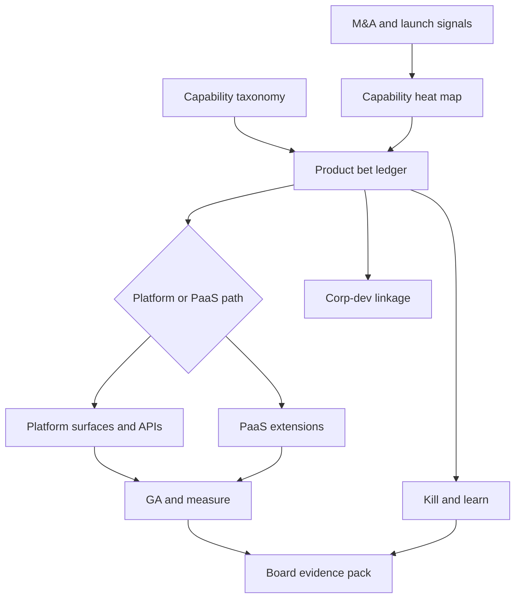

# Alloyra

**Source:** `ai-in-enterprise/deloitte-Cognitive-Technologies_Technology_MASTER/`
**Domain:** `ai-enterprise`
**One-liner:** A cognitive productization control plane for technology vendors that turns M&A heat maps, capability bets, and platform/PaaS extension choices into a governed roadmap from science-fiction vision to shippable product surfaces.
**Wedge:** Mid-size software, hardware, networking, and IT-services product companies (not hyperscalers) that watched 100 cognitive M&A deals from 2012–2015 and still have not decided which capabilities to build, buy, or embed into a developer platform versus a PaaS extension.
**Positioning:** Tech-sector cognitive strategy OS — distinct from enterprise AI adoption tools (Adoptra, Triara, Cognpulse), value attribution (Valorink), ops readiness (Operum), or integration governance (Bindora). Alloyra’s buyer is a product/strategy leader inside a technology company deciding how to *sell* cognitive capabilities, not a line-of-business leader deciding how to *use* them.

## Market research synthesis

### Thesis from source

Deloitte’s *Cognitive technologies in the technology sector* argues that AI has exited science-fiction R&D and entered applied productisation: “an array of applied cognitive technologies made more widely available through innovative enterprise architectures unique to the business culture of the technology sector.” Networking, semiconductor, hardware, IT, software, and internet players have all surged into the space — described as “the latest Silicon Valley arms race.” Since 2012 the sector logged 100 mergers and acquisitions involving cognitive technology companies, products, and services. Capabilities that were emerging years earlier are now mature enough to be “democratized” and embedded into existing products and into new markets.

The commercially actionable insight is asymmetry: assertive leaders do *not* imply wholesale adoption across the industry. Many technology companies still have not examined how cognitive technologies are changing their sector or how they — or competitors — might implement them. The report therefore offers three lenses. First, M&A patterns reveal which capabilities are “hot” (machine learning and computer vision attracting the most attention, with speech recognition and other clusters by year). Second, IBM Watson Group and Alphabet/Google illustrate business-model transformation — cognitive not only as feature enhancement but as a path to reinvent how the firm competes. Third, go-to-market splits into two innovation modes: **development platforms** that catalyse developer ecosystems (e.g. Watson Developers Cloud) and **PaaS extensions** that let customers run cognitive-enhanced apps without managing the underlying stack.

Widely used capability classes named in the source — computer vision, machine learning, speech recognition, rules-based systems, NLP, optimization, robotics, planning & scheduling — become a living taxonomy for product bets, not a slide. The open problem Alloyra owns is the mid-market tech vendor’s: without a hyperscaler’s M&A budget, which capabilities to acquire or partner for, which to productise as platform APIs, and which to ship as PaaS add-ons — with a clock and an owner on each bet.

### Buyer & economic model

- **Primary buyer:** Chief Product Officer or Corporate Strategy / Corporate Development lead at a technology vendor ($200M–$5B revenue) competing with platform giants.
- **Users:** Product managers for cognitive features; platform and PaaS owners; corp-dev and M&A analysts; alliance managers; competitive intelligence; board technology committee staff.
- **Budget owner / value metric:** Product and corp-dev budgets. Value metric is *shipped cognitive surfaces per funded year* and *share of revenue influenced by cognitive-enabled SKUs*, with a secondary metric of time from capability thesis to GA on a platform or PaaS path.
- **Competing status quo:** M&A trackers that count deals; product roadmaps in slides; alliance CRM; and one-off “AI strategy” decks. None bind heat-map evidence to a build/buy/partner decision, a platform-versus-PaaS path, or a kill criteria when a bet cools.

### Domain constraints

- **Regulatory / trust / safety:** Cognitive features in customer-facing products inherit sector regulation (privacy, safety-critical robotics, export of ML models). Acquiring a speech or vision startup can import IP and talent liabilities overnight.
- **Data sensitivity:** Competitive heat maps and unannounced M&A targets are board-sensitive; platform usage telemetry from ecosystem developers is commercially sensitive.
- **Change-management realities:** Engineering orgs treat “AI strategy” as theatre until it appears as a committed SKU with API contracts and GA dates. Alliance teams over-promise PaaS integrations that platform teams cannot staff.

## Business requirements

- BR-1: Every cognitive capability bet is registered against the source taxonomy (vision, ML, speech, NLP, rules, optimization, robotics, planning) with a named product owner and a build/buy/partner posture.
- BR-2: M&A and alliance signals update a living heat map; a capability that drops out of competitive heat for two review cycles must be re-justified or killed.
- BR-3: Each bet selects exactly one primary go-to-market path — developer platform surface or PaaS extension — with explicit ecosystem protocols or PaaS packaging criteria.
- BR-4: No bet reaches “committed roadmap” without a minimum-viable business-model thesis (enhance existing SKU vs open new market) recorded against the source’s transformation framing.
- BR-5: Platform bets publish API/resource contracts and developer participation targets; PaaS bets publish customer enablement scope and dependency on underlying PaaS SLAs.
- BR-6: Corp-dev opportunities link to capability gaps; orphan deals with no capability thesis cannot enter diligence.
- BR-7: Competitive responses (rival launches, acquisitions) create mandatory review events within a defined SLA.
- BR-8: Portfolio concentration limits prevent over-weighting a single hot capability at the expense of adjacency the firm already sells.
- BR-9: Kill and sunset decisions are recorded with evidence, so failed bets remain in the denominator of learning metrics.
- BR-10: Board and strategy packs reconcile shipped surfaces, influenced revenue, and open bets to the period’s product financials.
- BR-11: Talent and alliance capacity required per bet is declared; unstaffed bets are flagged capacity-unbacked.
- BR-12: Audit trail retains thesis, heat-map snapshots, path selection, and GA evidence for the product lifecycle.

## User stories

Canonical user stories live in sibling [USER_STORIES.md](USER_STORIES.md).

## System design

### Overview

Alloyra maintains a capability taxonomy register, a competitive heat map fed by M&A and launch signals, and a bet ledger. Each bet chooses a GTM path (developer platform vs PaaS extension), carries a business-model thesis, capacity plan, and stage gates through thesis → committed → GA → measure. Portfolio and board views reconcile shipped surfaces and influenced revenue. Governance retains heat-map snapshots and kill evidence.

### Actors & boundaries

- **Actors:** CPO, product managers, platform/PaaS owners, corp-dev, alliances, CI, board staff, strategy ops.
- **Trust boundary:** Unannounced targets and board packs restricted; ecosystem telemetry separated from corp-dev deal rooms.
- **Human-in-the-loop points:** Path selection, commit/kill decisions, diligence linkage approval, board pack issuance.

### Core capabilities

1. Capability taxonomy register
2. Competitive heat map and signal ingest
3. Bet ledger with build/buy/partner posture
4. Platform path management (APIs, ecosystem targets)
5. PaaS extension path management
6. Corp-dev opportunity linkage
7. Capacity and alliance staffing gates
8. Portfolio concentration and kill management
9. Board/strategy evidence packs
10. Audit and snapshot retention

### Conceptual data

- **Primary entities:** CapabilityClass, HeatMapSnapshot, MarketSignal, ProductBet, GtmPath, BusinessModelThesis, PlatformSurface, PaasExtension, CorpDevOpportunity, CapacityPlan, PortfolioPolicy, BoardPack, AuditEntry.
- **Critical events:** signal ingested; heat changed; bet opened; path selected; diligence linked; committed; GA shipped; kill recorded; board pack issued.
- **Retention / audit needs:** Heat snapshots and kill evidence retained for strategy audit horizon; deal-room data retained per counsel policy.

### Integrations (conceptual)

- **Systems of record:** Product roadmap tools; CRM/alliances; corp-dev pipeline; financial planning.
- **Upstream signals:** M&A feeds, rival launch monitoring, developer portal metrics, PaaS usage.
- **Downstream actions:** Roadmap commits, diligence kickoffs, board packs, alliance staffing requests.

### High-level architecture

### Success metrics

- **Leading:** Share of roadmap items with capability + path; median days thesis→commit; capacity-unbacked bet count; competitive review SLA hit rate.
- **Lagging:** Cognitive-influenced revenue share; shipped surfaces per year; kill-to-learn ratio; board-pack variance to finance.

## OpenAPI skeleton

Canonical HTTP surface lives in sibling `openapi.yaml`. Summarize here:

- **Base path:** `/v1/...`
- **Auth:** `ApiKeyAuth` (`X-API-Key`) for signal and metrics integrations; `BearerAuth` (JWT) for product, corp-dev, and strategy operators.
- **Resource groups:** Capabilities, Heat Map, Bets, Platform Paths, PaaS Paths, CorpDev, Portfolio, Governance.
