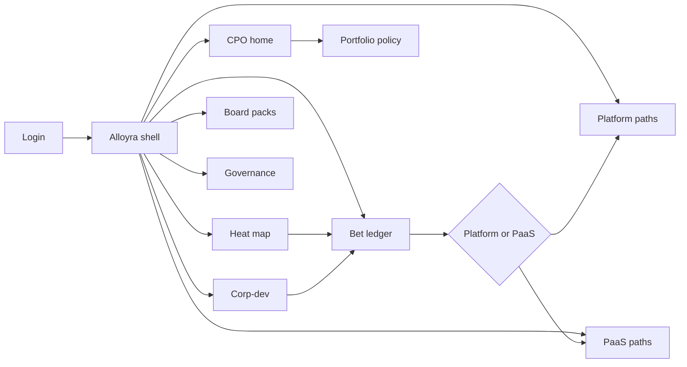
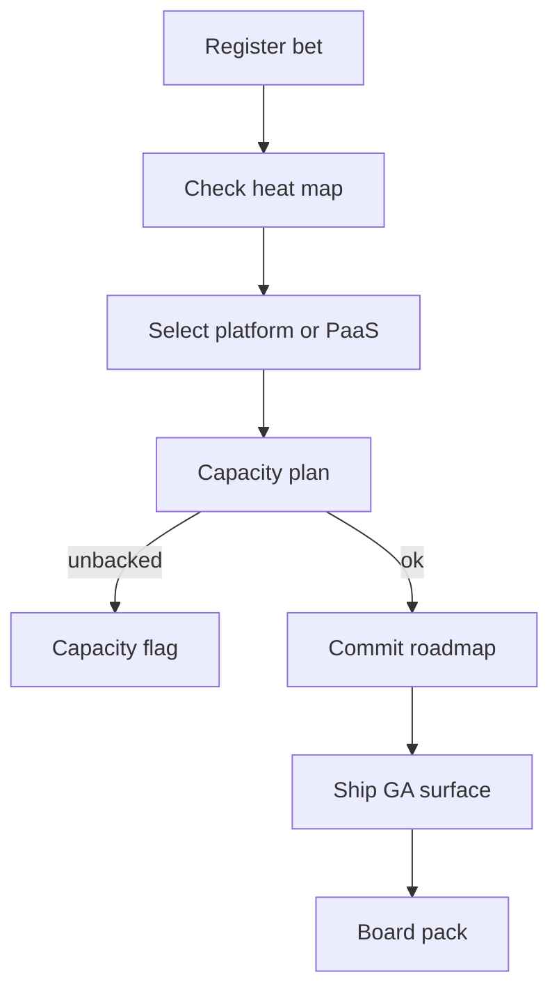

# Alloyra — Web app

**Product:** [PRODUCT.md](./PRODUCT.md)
**Primary surface:** Tech-vendor cognitive strategy console (capability bets → platform or PaaS path → GA)
**Secondary surfaces:** Corp-dev diligence linkage desk; board evidence pack viewer (read-only)
**Design thesis:** Alloyra is a productization forge for cognitive capabilities inside technology companies — the UI metaphor is a heat-fed bet ledger where every vision/ML/speech/NLP wager must pick exactly one ship path (developer platform surface vs PaaS extension) or die with recorded evidence. Visual language is foundry charcoal with copper heat for competitive intensity and quench-steel blue for committed GA surfaces. The brand wordmark anchors every heat map and kill review so CPOs know this is how they *sell* cognitive, not another enterprise “AI adoption” dashboard.

## UX research synthesis

### Category peers (best-in-class)

- **Productboard / Aha! strategy roadmaps:** Bet → commit → ship with owner accountability. Steal: thesis-to-GA stage chrome; reject feature-request democracy where Alloyra needs taxonomy + build/buy/partner posture.
- **PitchBook / CapIQ deal rooms (light UX):** M&A heat and diligence packages. Steal: orphan deals blocked without capability gap; reject finance-terminal density on the CPO home.
- **Kong Konnect / Stripe Dashboard developer platforms:** API contracts and ecosystem participation metrics. Steal: platform bets show protocols + developer targets, not a landing page; reject generic “API portal” as proof of platform.
- **Salesforce AppExchange / ISV PaaS consoles:** Extension packaging and base-platform SLA dependency. Steal: PaaS bets declare SLA coupling; reject marketplace storefront aesthetics for internal strategy OS.

### Patterns to adopt / reject

- **Adopt:** Living capability heat map; mandatory platform-xor-PaaS path; cool-heat auto kill review; corp-dev linked to gaps only; capacity-unbacked flags; kill retained in learning denominator; board pack reconciles influenced revenue.
- **Reject:** Enterprise change-management journey UIs; bot/RPA counts; purple “AI arms race” marketing; slide-deck roadmap as system of record; acquiring “interesting AI” without product home.

### Trust, density, and workflow constraints from PRODUCT.md

Unannounced M&A targets and board packs are highly restricted (deal-room ACL). Ecosystem developer telemetry stays out of corp-dev views. Concentration limits prevent overweighting one hot capability (BR-8). Competitive signals create timed review SLAs (BR-7). Density is strategy-grade for CPO; PMs get bet editors; CI gets signal inbox.

## Information architecture

### Nav model

### Roles → default home

| Role | Default home | Why |
|------|--------------|-----|
| Chief Product Officer | CPO home — shipped surfaces vs open bets | Productization accountability |
| Product manager | Bet ledger | Taxonomy + path + thesis (BR-1–4) |
| Platform / PaaS owner | Platform or PaaS paths | API/ecosystem or SLA scope (BR-5) |
| Corp-dev / M&A | Corp-dev opportunities | Diligence linkage (BR-6) |
| Competitive intelligence | Heat map + signals | Review SLA (BR-7) |
| Strategy ops / auditor | Kill log + board packs | Learning + reconcile (BR-9, BR-10) |

### Cross-links to OpenAPI resources

| Nav area | OpenAPI tags / resources |
|----------|---------------------------|
| Capability taxonomy | Capabilities |
| Heat snapshots, signals | Heat Map |
| Product bets, kill | Bets |
| API surfaces, ecosystem targets | Platform Paths |
| Extensions, SLA deps | PaaS Paths |
| Diligence opportunities | CorpDev |
| Board packs, concentration | Portfolio |
| Audit entries | Governance |

## Screen inventory

### CPO home

- **Purpose:** Answer “which cognitive bets are shipping as SKUs, and which are theatre?” in one composition.
- **Entry:** CPO post-login.
- **Layout regions:** Brand + fiscal period; strip (shipped surfaces YTD, influenced revenue share, capacity-unbacked count, cool-heat kill candidates); portfolio concentration chart; alerts (review SLA breaches, orphan deals).
- **Primary actions:** Open kill review; open board pack; rebalance concentration.
- **Empty / loading / error:** Empty = seed taxonomy + first bet; loading = skeleton strip; error = retry with request id.
- **BR / story ties:** BR-8, BR-10, BR-11; CPO stories.

### Capability taxonomy register

- **Purpose:** Living classes (vision, ML, speech, NLP, rules, optimization, robotics, planning) with owners.
- **Entry:** Settings / Capabilities.
- **Layout regions:** Class grid; coverage of bets; adjacency notes to existing SKUs.
- **Primary actions:** Edit class; assign taxonomy steward.
- **Empty / loading / error:** Unmapped roadmap item = amber.
- **BR / story ties:** BR-1.

### Competitive heat map

- **Purpose:** M&A and launch signals drive heat; two cool cycles → re-justify or kill.
- **Entry:** CI / CPO → Heat.
- **Layout regions:** Heat matrix by capability × period; signal feed; cool-heat flags; snapshot history.
- **Primary actions:** Ingest/confirm signal; open review event; snapshot for audit.
- **Empty / loading / error:** Stale feed = currency banner.
- **BR / story ties:** BR-2, BR-7, BR-12.

### Bet ledger and editor

- **Purpose:** Register bets with build/buy/partner, owner, business-model thesis, single GTM path.
- **Entry:** PM default; CPO drill.
- **Layout regions:** Ledger table (stage thesis→committed→GA→measure); editor panes for posture, thesis, path xor, capacity plan.
- **Primary actions:** Create bet; select path; commit; kill; link corp-dev.
- **Empty / loading / error:** Dual path selected = validation fail; no thesis = cannot commit (BR-4).
- **BR / story ties:** BR-1, BR-3, BR-4, BR-9.

### Platform path workspace

- **Purpose:** API/resource contracts and developer participation targets for platform bets.
- **Entry:** Path = Platform.
- **Layout regions:** Surface catalog; contract drafts; ecosystem KPIs; GA checklist.
- **Primary actions:** Publish contract; set participation target; mark GA.
- **Empty / loading / error:** Landing-page-only = blocked as “not a platform.”
- **BR / story ties:** BR-5; platform owner stories.

### PaaS extension workspace

- **Purpose:** Customer enablement scope and base PaaS SLA dependencies.
- **Entry:** Path = PaaS.
- **Layout regions:** Extension pack; dependency map; enablement scope; SLA risk.
- **Primary actions:** Declare dependency; publish enablement; mark GA.
- **Empty / loading / error:** Missing SLA dependency = amber block.
- **BR / story ties:** BR-5; PaaS owner stories.

### Corp-dev opportunity linkage

- **Purpose:** Diligence only when linked to a capability gap; orphan deals blocked.
- **Entry:** Corp-dev home.
- **Layout regions:** Opportunity queue; gap match; heat context; diligence gate.
- **Primary actions:** Link gap; kick off diligence; reject orphan.
- **Empty / loading / error:** No gap link = cannot enter diligence.
- **BR / story ties:** BR-6; corp-dev stories.

### Competitive review events

- **Purpose:** Rival launches/acquisitions open timed mandatory reviews.
- **Entry:** Signal → review; CI inbox.
- **Layout regions:** SLA countdown; matching bets; response options; close with decision.
- **Primary actions:** Acknowledge; adjust bet; escalate to kill/commit.
- **Empty / loading / error:** Overdue = coral.
- **BR / story ties:** BR-7.

### Portfolio concentration and capacity

- **Purpose:** Limits on single-capability overweight; staffed vs unstaffed bets.
- **Entry:** CPO → Portfolio.
- **Layout regions:** Concentration bars; capacity plan vs alliance asks; unbacked flags.
- **Primary actions:** Rebalance; flag unbacked; request staffing.
- **Empty / loading / error:** Over-limit = cannot commit new bet in hot class.
- **BR / story ties:** BR-8, BR-11.

### Kill and learn log

- **Purpose:** Record kill/sunset with evidence; keep failed bets in learning metrics.
- **Entry:** Bet → Kill; Governance.
- **Layout regions:** Kill form; evidence; denominator metrics; reopen policy.
- **Primary actions:** Kill; export learning.
- **Empty / loading / error:** Soft-delete without evidence forbidden.
- **BR / story ties:** BR-9.

### Board evidence pack

- **Purpose:** Reconcile shipped surfaces, influenced revenue, open bets to product financials.
- **Entry:** Board staff; CPO export.
- **Layout regions:** Pack builder; finance reconcile variance; heat snapshot attach; PDF/CSV.
- **Primary actions:** Issue pack; lock period.
- **Empty / loading / error:** Variance above threshold = amber callout.
- **BR / story ties:** BR-10, BR-12.

### Audit trail

- **Purpose:** Thesis, heat snapshots, path selection, GA evidence retained.
- **Entry:** Governance → Audit.
- **Layout regions:** Append-only entries; filters by bet; export.
- **Primary actions:** Export; pin to board pack.
- **Empty / loading / error:** Retention horizon notice.
- **BR / story ties:** BR-12.

## Key flows

1. **Thesis to GA** — register capability bet → heat context → pick platform xor PaaS → capacity plan → commit → GA → measure; failure: unstaffed or no thesis blocks commit.

2. **Cool-heat kill** — two cool cycles → kill review → evidence → kill or re-justify.

3. **Corp-dev diligence** — opportunity → link capability gap → diligence; orphan rejected.

4. **Competitive review SLA** — rival signal → timed review → bet adjust/kill/commit.

5. **Board reconcile** — period close → shipped + influenced revenue + open bets → variance check → issue pack.

## Design system

### Tokens (CSS variables)

- `--color-ink: #F0E8DE` — text on dark
- `--color-foundry-950: #14110F` — ground
- `--color-foundry-900: #1E1A17` — panels
- `--color-foundry-700: #3F3730` — rules
- `--color-copper: #D4894A` — competitive heat
- `--color-quench: #6B8FBF` — committed / GA surface
- `--color-mint: #6FAF8E` — influenced revenue healthy
- `--color-coral: #D95A4A` — overdue review / orphan deal
- `--color-steel: #A89F94` — secondary
- `--color-brand: #E0C4A8` — Alloyra wordmark (forge light)
- `--font-display: "Manrope", sans-serif`
- `--font-mono: "IBM Plex Mono", monospace` — bet ids, API resource names
- `--space-1`…`--space-8`: 4px scale
- `--radius-sm: 4px`; `--radius-md: 8px`
- `--motion-heat: 240ms ease-in-out` — heat cell intensify
- `--motion-quench: 180ms ease-out` — GA commit flash
- Atmosphere: subtle slag/grain texture on foundry-900; copper only on heat — no purple Silicon Valley glow; no cream-serif strategy brochure look.

### Typography & brand

- Display for capability names and revenue share; mono for API contracts and bet ids.
- Brand on heat map and board pack; login: “Ship cognitive as product, not fiction”; one CTA.

### Do / don’t

- **Do:** Force one GTM path; link deals to gaps; retain kills; show capacity backing; reconcile board to finance.
- **Don’t:** Enterprise adoption journey chrome; purple AI; dual platform+PaaS without primary; silent bet deletion; card grids of “AI themes.”

### Accessibility & domain trust cues

- AA+ contrast; heat uses pattern + value, not colour alone.
- Live regions for review SLA and kill flags.
- Focus: bet → path → GA → board.
- Deal-room ACL watermarks on unannounced targets.

## Component patterns

- **CapabilityHeatMatrix** — living heat with cool-cycle flags.
- **BetPathXor** — platform vs PaaS exclusive control.
- **BusinessModelThesisCard** — enhance SKU vs new market.
- **PlatformContractPanel** — API resources + ecosystem targets.
- **PaasSlaDependency** — base platform coupling warning.
- **CorpDevGapGate** — block orphan diligence.
- **KillEvidenceForm** — retained learning denominator.
- **BoardReconcilePack** — shipped / revenue / open bets.

## Out of scope for v1 web

- Training/hosting customer ML models; enterprise CoE adoption portals; public developer community forums; full IB/M&A banking suite; native mobile for CPO; white-label multi-vendor strategy SaaS.
